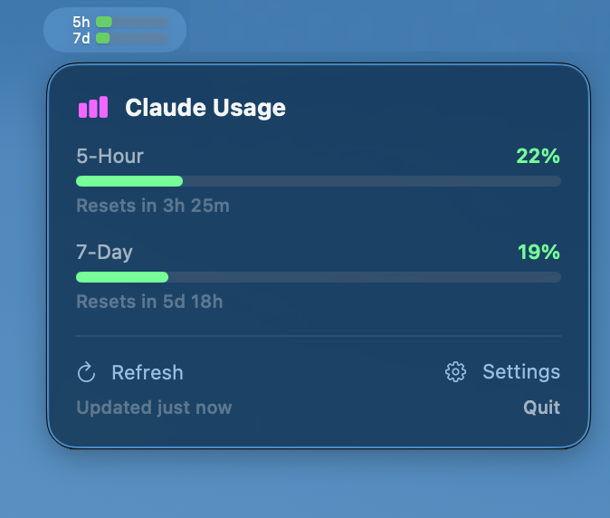

# spec4-claude-usage

A macOS menu bar app that shows your Claude AI usage limits — built entirely from a spec, not from source code.

## What is this?

This repo contains no application code. Instead, it contains a **spec** — a human-readable specification file ([`spec.md`](spec.md)) that you feed to an AI coding assistant. The AI reads the spec and builds the entire app on your machine, from scratch.

**You don't run my code. You read my spec, and your AI writes the code.**

## Why?

### The trust problem

This app needs your Claude session key — a sensitive credential that grants full access to your Claude.ai account. Would you paste that into a random GitHub project's binary? Into someone's Swift code you didn't audit?

Most people wouldn't. But most people also don't *actually* read the source code of FOSS projects they install. We say "it's open source, you can audit it" — but realistically, nobody does. You `git clone`, you `make install`, you trust the stars count.

**spec4** flips this: instead of publishing code you won't read, I publish a spec you *can* read. It's ~280 lines of plain English that describe exactly what gets built:

- What network calls are made (only to `claude.ai`)
- Where credentials are stored (`UserDefaults`, not uploaded anywhere)
- What frameworks are used (only Apple system frameworks, zero dependencies)
- What the UI looks like, what buttons do what

You can read the entire spec in 5 minutes and understand every decision. Try doing that with 2000 lines of Swift.

### The experiment

Let's be honest: it's a bit absurd that 100 people would each burn LLM tokens to build the same app from a spec, when I could just ship the binary. This project is as much an experiment as it is a tool.

The surprising result: **it works, and it's remarkably reproducible.** Different AI models, different machines, different sessions — they all produce a working app from the same spec. The spec has been iteratively refined through multiple test runs to handle platform gotchas that neither I nor the AI anticipated on the first try.

This spec was developed using Claude (Opus) via Claude Code.

## How to use

1. Open [`spec.md`](spec.md) and read the "For Humans" section at the top
2. Copy the entire file content
3. Paste it into an AI coding tool with terminal access:
   - **Claude Code** (recommended — this is what it was tested with)
   - **Cursor** (Composer with terminal access)
   - Any AI assistant that can run shell commands
4. Let it run. It will detect your system, write the code, compile it, package it as a `.app`, and launch it.
5. Click the chart icon in your menu bar, open Settings, and paste your Claude session key.

**Requirements:** macOS 14+ (Sonoma), Xcode Command Line Tools

## What the app does

- Shows your Claude.ai usage limits (5-hour session, 7-day rolling) as color-coded progress bars in the macOS menu bar
- Click to see detailed usage with reset timers
- Configurable display styles (graphical bars, text, dot indicators)
- Auto-refreshes on a configurable interval
- Pure Swift/SwiftUI, zero dependencies, no telemetry

## Disclaimer

This project is not affiliated with, endorsed by, or associated with Anthropic, PBC. "Claude" is a trademark of Anthropic. This is an independent, unofficial tool that interacts with the Claude.ai web interface using your own session credentials.

## License

The spec is public domain. The AI-generated code on your machine is yours.
